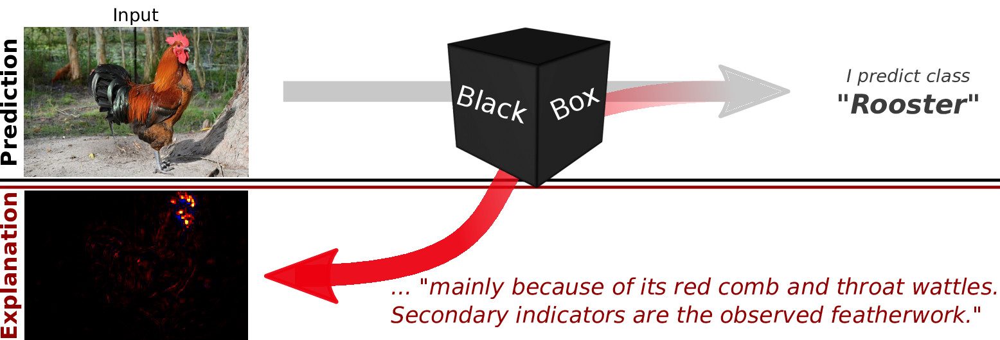
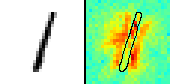
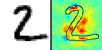
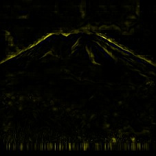
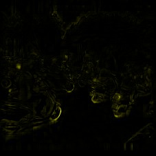

# The LRP Toolbox for Artificial Neural Networks (1.3.0)

The Layer-wise Relevance Propagation (LRP) algorithm explains a classifer's prediction
specific  to  a  given  data  point  by  attributing
relevance scores to  important  components
of  the  input  by  using  the  topology  of  the  learned  model  itself.

The LRP Toolbox provides simple and accessible stand-alone implementations of LRP for artificial neural networks supporting Matlab and python. The Toolbox realizes LRP functionality for the Caffe Deep Learning Framework as an extension of Caffe source code published in 10/2015.

The  implementations  for  Matlab  and  python  are intended as a sandbox or playground to familiarize the user to the LRP algorithm and  thus are implemented with readability and transparency in mind.  Models and data can be imported and exported using raw text formats, Matlab's .mat files and the .npy format for python/numpy.

### See the LRP Toolbox in Action
To try out either the python-based MNIST demo, or the Caffe based ImageNet demo in your browser, click on the respective panels:

| **MNIST**     | **Images**           | **Text**  |
|:-----------:|:-------------:|:-----:|
|       |  | |
| A simple LRP demo based on neural networks that predict handwritten digits and were trained using the MNIST data set.       |   A more complex LRP demo based on a neural network implemented using Caffe. The neural network predicts the contents of the picture.    |   An LRP demo that explains classification on natural language. The neural network predicts the type of document.  |

### New in 1.3.0:
#### standalone python implementation:
* update to python 3
* updated treatment of softmax and target class
* lrp_aware option for efficient calculation of multiple backward passes (at the cost of a more expensive forward pass)
* custom colormaps in render.py
* __gpu support__ when [cupy](https://github.com/cupy/cupy) is installed. this is an optional feature. without the cupy package, the python code will execute using the cpu/numpy.

### caffe implementation
* updated the installation config
* new [**recommended**](https://arxiv.org/abs/1910.09840) formula types 100, 102, 104
* support for Guided Backprop via formula type 166
* new python wrapper to use lrp in pycaffe
* pycaffe demo file
* bugfixes
* [singularity image definition](singularity/caffe-lrp-cpu-u16.04.def) for building a hassle-free OS-agnostic command line executable 

### New in version 1.2.0
#### The standalone implementations for python and Matlab:
* Convnets with Sum- and Maxpooling are now supported, including demo code.
* LRP-parameters can now be set for each layer individually
* w² and flat weight decomposition implemented.

#### Caffe:
* Minimal output versions implemented.
* Matthew Zeiler et al.'s  Deconvolution, Karen Simonyan et al.'s Sensitivity Maps, and aspects of Grégoire Montavon et al.'s Deep Taylor Decomposition are implemented, alongside the flat weight decomposition for uniformly projecting relevance scores to a neuron's receptive field have been implemented.

#### Also:
* Various optimizations, refactoring, bits and pieces here and there.

### Obtaining the LRP Toolbox:
Clone or download it from github!

### Installing the Toolbox:

After having obtained the toolbox code, data and models of choice, simply move into the subpackage folder of you choice -- matlab, python or caffe-master-lrp -- and execute the installation script (written for Ubuntu 14.04 or newer). 

    <obtain the toolbox>
    cd lrp_toolbox/$yourChoice
    bash install.sh

Make sure to at least skim through the installation scripts! For more details and instructions please refer to [the manual](https://github.com/sebastian-lapuschkin/lrp_toolbox/blob/master/doc/manual/manual.pdf).

#### Attention for Caffe-LRP
We highly recommend building LRP for Caffe via the [singularity image definition](singularity/caffe-lrp-cpu-u16.04.def) (You might regret doing something else outside of Ubuntu 14.04 LTS or Ubuntu 16.04 LTS...):
Call

	cd <toolbox_location>/singularity
	singularity build --fakeroot --force caffe-lrp-cpu-u16.04.sif caffe-lrp-cpu-u16.04.def

and the go have a coffee. The resulting caffe-lrp-cpu-u16.04.sif is an (executable) Singularity image which allows you to process LRP (and other methods) for Caffe Models with

[singularity run] ./caffe-lrp-cpu-u16.04.sif -c CONFIGPATH -f FILELISTPATH -p OUTPUTPATH

Have a look at [the manual](https://github.com/sebastian-lapuschkin/lrp_toolbox/blob/master/doc/manual/manual.pdf) for details.

### The LRP Toolbox Paper

When using (any part) of this toolbox, please cite [our paper](http://jmlr.org/papers/volume17/15-618/15-618.pdf)

    @article{JMLR:v17:15-618,
        author  = {Sebastian Lapuschkin and Alexander Binder and Gr{{\'e}}goire Montavon and Klaus-Robert M{{{\"u}}}ller and Wojciech Samek},
        title   = {The LRP Toolbox for Artificial Neural Networks},
        journal = {Journal of Machine Learning Research},
        year    = {2016},
        volume  = {17},
        number  = {114},
        pages   = {1-5},
        url     = {http://jmlr.org/papers/v17/15-618.html}
    }

    
### Misc & Related

For further research and projects involving LRP, visit [heatmapping.org](http://heatmapping.org)

Also, consider paying https://github.com/albermax/innvestigate a visit! Next to LRP, iNNvestigate efficiently implements a hand full of additional DNN analysis methods and can boast with a >500-fold increase in computation speed when compared with our CPU-bound Caffe implementation! 

